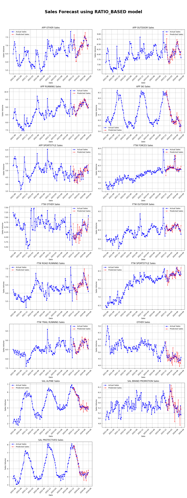
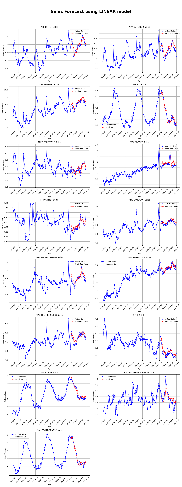

# slm-forecast

Salomon sales forecasting tool.

## Installation

[Poetry](https://python-poetry.org/) is required. Install with:

```bash
poetry install
```

## Setup

Expected input CSV format:

```csv
WEEK,APP OTHER,APP OUTDOOR,APP RUNNING,...
2021-05-31,654.0,1987.0,3822.0,...
2021-06-07,869.0,2126.0,4046.0,...
...
```

Download data and copy to `data/raw`, then process data (indexing and log transform):

```bash
mkdir -p ./data/raw
cp ~/Downloads/sales.csv ./data/raw/sales.csv
poetry run python main.py process
```

## Evaluation

```bash
poetry run python main.py evaluate_all
```

### Ratio-based - 2024 prediction - $R^2 = 9\%$




### Linear regression - 2024 prediction - $R^2 = 48\%$

